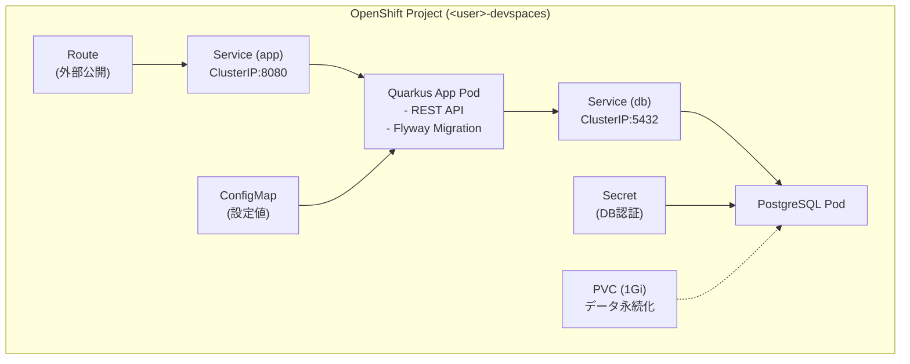
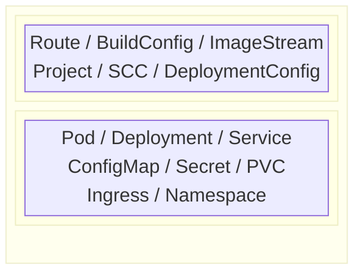

# 00. イントロダクション

> 所要時間: 10分（座学）

## ワークショップの目的

本ワークショップの目的は、**コンテナアプリケーションのデプロイに必要な一連の作業をすべて手作業で体験し、CI/CD 自動化の必要性を体験的に理解すること**です。

### 本日のアジェンダ

以下の作業を**すべて手作業で**実施します。

1. アプリケーションのテスト実行
2. コンテナイメージのビルド
3. アプリケーションとデータベースのデプロイ
4. サービスの外部公開
5. 設定値・機密情報の管理
6. データの永続化
7. ログの確認
8. プロモーション（dev → prod 設定の切り替え）
9. 補足: RBAC と ServiceAccount（CI/CD に向けた権限管理の基礎）

## 本日のアーキテクチャ

本日扱うアプリケーションは、Quarkus (Java) で作成された REST API と PostgreSQL データベースの 2 コンポーネント構成です。

> **Quarkus とは**: Red Hat が主導する Java フレームワークで、コンテナ環境（Kubernetes / OpenShift）での実行に最適化されています。起動が高速でメモリ消費が少なく、MicroProfile / Jakarta EE 標準に準拠しているため、既存の Java スキルをそのまま活かせます。Spring Boot のようなフレームワークと同じ位置付けですが、クラウドネイティブに特化している点が特徴です。



## OpenShift と Kubernetes の関係

OpenShift は Kubernetes をベースに、エンタープライズ向けの機能を追加したプラットフォームです。



- Kubernetes の `kubectl` コマンドはすべて使えますが、OpenShift では `oc` コマンドが追加機能を提供します
- 本ワークショップで使う Deployment, Service, ConfigMap, Secret, PVC は **Kubernetes 標準リソース**であり、どの Kubernetes 環境でも使えます
- Route, BuildConfig, ImageStream は **OpenShift 固有リソース**です

## OpenShift 基本リソースの復習

OpenShift / Kubernetes では、あらゆる構成要素が**リソース**として定義・管理されます。以下は本ワークショップで使用する主要リソースです。

### ワークロード系リソース

| リソース | 説明 |
|---------|------|
| **Pod** | コンテナの実行単位。1つ以上のコンテナを含む最小のデプロイ単位 |
| **Deployment** | Pod の望ましい状態（レプリカ数、イメージ等）を宣言的に管理するリソース |
| **ReplicaSet** | Deployment が内部的に作成するリソース。指定数の Pod を常に維持する |

### ネットワーク系リソース

| リソース | 説明 |
|---------|------|
| **Service** | Pod へのネットワークアクセスを提供するリソース。固定の DNS 名で Pod にアクセスできる |
| **Route** | Service を外部に公開する OpenShift 固有リソース（K8s の Ingress に相当） |

### 設定・ストレージ系リソース

| リソース | 説明 |
|---------|------|
| **ConfigMap** | 設定データを Key-Value 形式で管理し、Pod に環境変数やファイルとして注入するリソース |
| **Secret** | 機密データ（パスワード等）を管理するリソース（Base64 エンコード + ETCD 暗号化で保護） |
| **PVC** | 永続ストレージの要求を定義するリソース。Pod のライフサイクルとは独立してデータを保持する |

### ビルド・イメージ系リソース（OpenShift 固有）

| リソース | 説明 |
|---------|------|
| **BuildConfig** | コンテナイメージのビルド手順を定義するリソース |
| **ImageStream** | ビルドしたイメージのタグ管理・参照を行うリソース |

### プロジェクト管理

| リソース | 説明 |
|---------|------|
| **Project** | Kubernetes の Namespace に RBAC やリソース制限を追加したもの。リソースの分離単位 |

## ハンズオン: 環境セットアップ

> **注**: DevSpaces を利用しているため、OpenShift へのログインとプロジェクト作成は不要です。DevSpaces 起動時に `<user>-devspaces` プロジェクトが自動で割り当てられています。

### 1. プロジェクトの確認

```bash
oc project
```

期待される出力例:
```
Using project "userXX-devspaces" on server "https://api.<cluster-domain>:6443".
```

現在のプロジェクトが `<user>-devspaces` であることを確認してください。

---

**次のセクション**: [01. ソースコード確認 & テスト](01-source-and-test.md)
