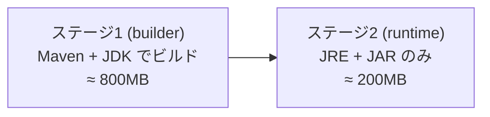
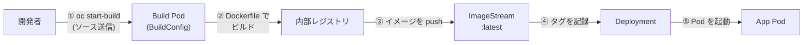

# 02. イメージビルド

> 所要時間: 20分（座学 5分 + ハンズオン 15分）

## 座学: コンテナイメージとビルド

### コンテナとコンテナイメージ

- **コンテナ**: アプリケーションとその実行に必要なライブラリ・設定を一つにパッケージし、ホスト OS 上で隔離された環境として実行する仕組みです。「どの環境でも同じように動く」ことが最大のメリットです
- **コンテナイメージ**: コンテナの実行に必要なファイルシステムの**テンプレート（スナップショット）**です。イメージからコンテナを起動します。一度作成したイメージは変更されない（イミュータブル）ため、dev で検証したイメージをそのまま prod で使えます

### コンテナレジストリ

コンテナレジストリは、ビルドしたイメージを保存・配布するためのリポジトリです。

| レジストリ | 説明 |
|-----------|------|
| **OpenShift 内部レジストリ** | クラスタに組み込まれたレジストリ。ビルドしたイメージが自動で push される（本ワークショップで使用） |
| **Docker Hub** | パブリックな汎用レジストリ |
| **Quay.io** | Red Hat が提供するエンタープライズ向けレジストリ |
| **Amazon ECR / Google GCR** | 各クラウドプロバイダのマネージドレジストリ |

### Dockerfile とは

Dockerfile はコンテナイメージを作成するための**手順書（レシピ）**です。テキストファイルに「どのベースイメージを使い」「何をインストールし」「どうアプリを配置するか」を命令として記述します。`docker build` や OpenShift のビルド機構がこのファイルを読み取り、上から順に命令を実行してイメージを組み立てます。

#### Dockerfile の主要命令

| 命令 | 役割 | 例 |
|------|------|-----|
| `FROM` | ベースイメージを指定する（Dockerfile の最初に必須） | `FROM openjdk-17:1.20` |
| `WORKDIR` | 以降の命令の作業ディレクトリを設定する | `WORKDIR /build` |
| `COPY` | ホスト（ローカル）のファイルをイメージ内にコピーする | `COPY pom.xml .` |
| `RUN` | イメージ内でコマンドを実行する（ビルド時に1回だけ実行される） | `RUN mvn package` |
| `ENV` | 環境変数を設定する | `ENV JAVA_APP_JAR="/deployments/app.jar"` |
| `EXPOSE` | コンテナが使用するポートを宣言する（ドキュメント目的） | `EXPOSE 8080` |
| `USER` | 以降の命令やコンテナ実行時のユーザーを切り替える | `USER 185` |
| `ENTRYPOINT` | コンテナ起動時に実行されるコマンドを指定する | `ENTRYPOINT ["java", "-jar", "app.jar"]` |

> **`RUN` と `ENTRYPOINT` の違い**
> - `RUN` はイメージ**ビルド時**に実行される（パッケージのインストールやビルドなど）
> - `ENTRYPOINT` はコンテナ**起動時**に実行される（アプリケーションの起動）

#### 本アプリケーションの Dockerfile を読み解く

```dockerfile
# === ステージ 1: ビルド ===
FROM registry.access.redhat.com/ubi8/openjdk-17:1.20 AS builder  # ① ベースイメージ（JDK 入り）

USER root                    # ② ビルドに必要な権限を取得
WORKDIR /build               # ③ 作業ディレクトリを作成・移動
COPY pom.xml .               # ④ 依存定義ファイルをコピー
COPY src ./src               # ⑤ ソースコードをコピー

RUN mvn package -DskipTests  # ⑥ Maven でアプリをビルド（JAR を生成）

# === ステージ 2: ランタイム ===
FROM registry.access.redhat.com/ubi8/openjdk-17-runtime:1.20  # ⑦ 軽量なランタイムイメージ（JRE のみ）

COPY --from=builder /build/target/quarkus-app/ /deployments/  # ⑧ ステージ1の成果物だけをコピー

EXPOSE 8080                  # ⑨ ポート 8080 を使用することを宣言
USER 185                     # ⑩ 非 root ユーザーで実行（セキュリティ）

ENTRYPOINT ["/opt/jboss/container/java/run/run-java.sh"]      # ⑪ コンテナ起動コマンド
```

#### マルチステージビルド

上記のように `FROM` が 2 回登場するのが**マルチステージビルド**のパターンです。



| 項目 | シングルステージ | マルチステージ |
|------|-----------------|--------------|
| イメージサイズ | 大（ビルドツール込み） | 小（ランタイムのみ） |
| セキュリティ | ビルドツールが攻撃対象になりうる | 必要最小限のバイナリのみ |
| ビルド速度 | 変わらない | 変わらない |

メリット:
- ビルドツール（Maven, JDK）がランタイムイメージに含まれない
- イメージサイズの削減（本アプリでは約 1/4）
- セキュリティの向上（攻撃対象の最小化）

> **初心者向けポイント**: Dockerfile は「料理のレシピ」と考えると分かりやすいです。`FROM` は「使う鍋（ベースイメージ）を選ぶ」、`COPY` は「材料を入れる」、`RUN` は「調理する」、`ENTRYPOINT` は「盛り付けて提供する」に相当します。

### OpenShift のビルド機構

| 概念 | 説明 |
|------|------|
| **BuildConfig** | ビルドの設定を定義するリソース（ソース、Dockerfile、出力先等） |
| **Build** | BuildConfig に基づく実際のビルド実行。Pod として起動され、完了後に自動削除される |
| **ImageStream** | OpenShift 内部でイメージを管理するリソース。タグ管理やトリガーに使用 |

`oc new-build` コマンドは、BuildConfig と ImageStream を自動作成します。

### OpenShift でのビルドフロー

以下は、ソースコードからコンテナイメージが作成され、デプロイされるまでの全体像です。



### OpenShift 内部レジストリ

OpenShift には**内部コンテナレジストリ**が組み込まれています。

- ビルドしたイメージはこの内部レジストリに自動で push される
- クラスタ内部からは `image-registry.openshift-image-registry.svc:5000/<project>/<image>:<tag>` でアクセス
- 外部のレジストリ（Docker Hub, Quay.io 等）も利用可能だが、内部レジストリを使うことでネットワーク遅延を回避できる

### ImageStream の役割

ImageStream は単なるイメージの参照先リストですが、OpenShift のデプロイと連携する点で重要です。

- イメージの**タグ変更を検知**して、Deployment の自動更新トリガーにできる
- `oc tag` コマンドでタグを操作し、プロモーション（dev → prod）を実現する
- 外部レジストリのイメージも ImageStream として取り込める

## ハンズオン

### 1. Dockerfile の確認

```bash
cat Dockerfile
```

実際の Dockerfile の内容:

```dockerfile
FROM registry.access.redhat.com/ubi8/openjdk-17:1.20 AS builder

USER root
WORKDIR /build
COPY pom.xml .
COPY src ./src

RUN mvn package -DskipTests -Dmaven.javadoc.skip=true

FROM registry.access.redhat.com/ubi8/openjdk-17-runtime:1.20

ENV LANGUAGE='en_US:en'

COPY --from=builder /build/target/quarkus-app/lib/ /deployments/lib/
COPY --from=builder /build/target/quarkus-app/*.jar /deployments/
COPY --from=builder /build/target/quarkus-app/app/ /deployments/app/
COPY --from=builder /build/target/quarkus-app/quarkus/ /deployments/quarkus/

EXPOSE 8080
USER 185

ENV JAVA_OPTS_APPEND="-Dquarkus.http.host=0.0.0.0 -Djava.util.logging.manager=org.jboss.logmanager.LogManager"
ENV JAVA_APP_JAR="/deployments/quarkus-run.jar"

ENTRYPOINT [ "/opt/jboss/container/java/run/run-java.sh" ]
```

各行の解説:

| 行 | 命令 | 説明 |
|----|------|------|
| 1 | `FROM ... AS builder` | ステージ 1 開始。JDK 17 入りの UBI イメージを `builder` と名付ける |
| 3 | `USER root` | Maven ビルドでファイル書き込みが必要なため root に切替え |
| 4 | `WORKDIR /build` | 作業ディレクトリ `/build` を作成して移動 |
| 5 | `COPY pom.xml .` | 依存関係定義ファイルをイメージ内にコピー |
| 6 | `COPY src ./src` | ソースコードをコピー |
| 8 | `RUN mvn package ...` | Maven でビルドを実行し JAR を生成（テストはスキップ） |
| 10 | `FROM ...-runtime:1.20` | ステージ 2 開始。JRE のみの軽量イメージに切替え |
| 12 | `ENV LANGUAGE=...` | ロケール環境変数を設定 |
| 14-17 | `COPY --from=builder ...` | ステージ 1 のビルド成果物（Quarkus アプリ）だけをコピー |
| 19 | `EXPOSE 8080` | アプリが 8080 番ポートで待ち受けることを宣言 |
| 20 | `USER 185` | セキュリティのため非 root ユーザー（UID 185）に切替え |
| 22-23 | `ENV ...` | Quarkus の実行に必要な Java オプションと JAR パスを設定 |
| 25 | `ENTRYPOINT [...]` | コンテナ起動時に実行するスクリプトを指定 |

ポイント:
- **ベースイメージ**: `registry.access.redhat.com/ubi8/openjdk-17` (Red Hat Universal Base Image)
  - ベースイメージとは、Dockerfile の `FROM` で指定する土台となるイメージです。OS やランタイム（ここでは RHEL8 + OpenJDK 17）が含まれており、その上にアプリケーションを追加します
  - UBI (Universal Base Image) は Red Hat が提供する商用サポート付きのベースイメージで、OpenShift 環境での利用に最適化されています
- **マルチステージビルド**: ステージ 1（`builder`）でビルドし、ステージ 2 では成果物だけをコピーすることで、最終イメージにビルドツールを含めない
- **非 root 実行**: `USER 185` により、コンテナが root 権限で動作しないようにしている（OpenShift のセキュリティベストプラクティス）

### 2. BuildConfig の作成

```bash
oc new-build --name=workshop-app \
  --binary \
  --strategy=docker \
  -l app=workshop-app
```

各オプションの意味:

| オプション | 説明 |
|-----------|------|
| `--name=workshop-app` | BuildConfig と出力先 ImageStream の名前を指定 |
| `--binary` | ソースコードをローカルからアップロードするバイナリビルドモードを使用（Git URL の代わり） |
| `--strategy=docker` | Dockerfile を使用してビルドする戦略を指定（他に `source` 戦略もある） |
| `-l app=workshop-app` | 作成されるリソースに `app=workshop-app` ラベルを付与（後のリソース管理に使用） |

> **補足: `--strategy=source`（S2I）について**
>
> `--strategy=docker` の代わりに `--strategy=source`（**Source-to-Image = S2I**）を使うと、**Dockerfile なしで**コンテナイメージをビルドできます。
>
> | 項目 | Docker 戦略 | Source（S2I）戦略 |
> |------|------------|------------------|
> | Dockerfile | **必要** | **不要** |
> | 仕組み | Dockerfile の手順に従ってビルド | ビルダーイメージがソースコードを自動検出してビルド |
> | 柔軟性 | 高い（ビルド手順を自由に記述） | 規約ベース（言語・フレームワークに応じた標準ビルド） |
> | 用途 | カスタマイズが必要な場合 | 標準的なアプリを素早くビルドしたい場合 |
>
> **どちらを選ぶべきか？（判断フローチャート）**
>
> ```
> ビルド手順に特殊な要件がある？
>   ├─ YES → Docker 戦略
>   └─ NO
>        標準的な言語/フレームワーク（Java, Node.js, Python 等）を使用？
>          ├─ YES → S2I 戦略が手軽
>          └─ NO  → Docker 戦略
> ```
>
> **Docker 戦略を選ぶケース:**
> - マルチステージビルドでイメージサイズを最適化したい
> - OS レベルのパッケージ追加や設定変更（`yum install` 等）が必要
> - 複数のプロセスやサイドカー的な構成をイメージに含めたい
> - ビルド手順を完全にコントロールしたい（再現性を重視）
>
> **S2I 戦略を選ぶケース:**
> - Dockerfile を書くスキルがチームにない、または学習コストを下げたい
> - 標準的な構成（Spring Boot, Node.js Express 等）で素早くデプロイしたい
>
> | 判断基準 | Docker 戦略 | S2I 戦略 |
> |---------|------------|----------|
> | 立ち上げ速度 | Dockerfile の作成が必要 | ソースコードだけで即ビルド |
> | カスタマイズ性 | ◎ 自由自在 | △ ビルダーの範囲内 |
> | セキュリティ管理 | 自分でベースイメージを更新 | ビルダーイメージ更新で自動反映 |
> | 学習コスト | Dockerfile の知識が必要 | 低い（規約に従うだけ） |
> | 本番運用 | ◎ 実績豊富 | ○ 標準アプリなら十分 |
>
> S2I の使用例:
> ```bash
> oc new-build --name=workshop-app \
>   --binary \
>   --strategy=source \
>   --image-stream=java:17 \
>   -l app=workshop-app
> ```
> `--image-stream=java:17` で OpenShift が提供する Java 17 用ビルダーイメージを指定します。ビルダーイメージがソースコードの検出・ビルド・ランタイム配置を自動で行うため、Dockerfile を書く必要がありません。
>
> 本ワークショップではビルドの仕組みを理解するために `docker` 戦略を使用しています。

### 3. ソースコードをアップロードしてビルド開始

```bash
oc start-build workshop-app --from-dir=. --follow
```

`--follow` オプションにより、ビルドログがリアルタイムで表示されます。

### 4. ビルドの進行状況を確認

> **注**: 手順 3 で `--follow` を使用した場合、同じターミナルではビルドログが表示されています。この手順は**ビルド中**に別のターミナルを開いて、ビルドのステータスを確認する方法です。

別のターミナルで:

```bash
# ビルド一覧
oc get builds

# ビルドログの確認
oc logs build/workshop-app-1
```

ビルドのステータスは以下のように遷移します:

| ステータス | 説明 |
|-----------|------|
| **New** | ビルドが作成された直後の状態 |
| **Pending** | ビルド Pod の起動待ち |
| **Running** | ビルドが実行中（Dockerfile の各ステップを処理中） |
| **Complete** | ビルドが正常に完了し、イメージが内部レジストリに push された |
| **Failed** | ビルドが失敗（Dockerfile のエラー、リソース不足等） |

### 5. ImageStream の確認

ビルドが完了したら、作成されたイメージを確認します。

```bash
# ImageStream 一覧
oc get is

# ImageStream の詳細
oc describe is/workshop-app
```

出力例:
```
Name:         workshop-app
...
Tags:         latest
  ...
  Image Name: sha256:xxxxxx
```

---

### ここまでの手作業の積み上がり

前セクションから続けて、**1回のコード変更**に対して手動で行った作業を振り返ります:

```
01 で実施済み:
  ソースコード確認 → Flyway 確認 (4ファイル) → テスト実行 (11件)
  → テストレポート確認 (3ファイル)
  → SpotBugs 実行 → Checkstyle 実行 → PMD 実行 → 各結果確認

02 で追加:
  → Dockerfile 確認 → BuildConfig 作成 → ビルド開始
  → ビルドログ確認 → ImageStream 確認
```

> **ポイント**: ここまでで既に **13 ステップ以上** の手作業を行っています。テスト通過 → 静的解析 3 種 OK → イメージビルドという一連の流れは、CI パイプラインの基本です。次回の CI 編 (Tekton) では、これらすべてが **`git push` だけで自動実行** されます。

---

**次のセクション**: [03. デプロイメント](03-deployment.md)
