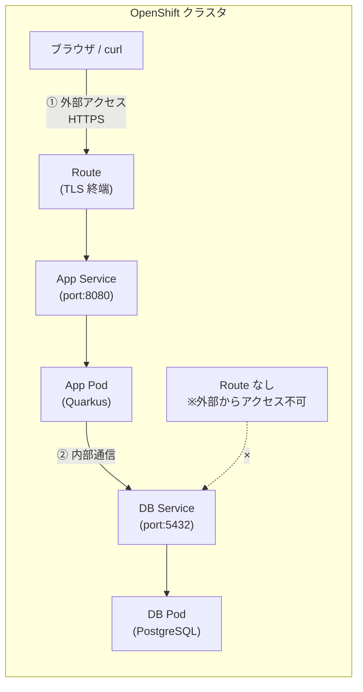

# 04. サービス公開 - Service と Route

> 所要時間: 15分（座学 5分 + ハンズオン 10分）

## 座学: Service と Route

### Service の役割

Service は Pod へのネットワークアクセスを提供する抽象レイヤーです。

- Pod の IP アドレスは起動のたびに変わるが、Service は固定のアクセスポイント（DNS 名）を提供
- ラベルセレクタで対象 Pod を決定し、複数 Pod がある場合は**自動的に負荷分散**する

### Service の種類

| 種類 | 説明 | 本ワークショップでの利用 |
|------|------|------------------------|
| **ClusterIP** | クラスタ内部からのみアクセス可能（デフォルト） | `app`, `db` 両方で使用 |
| **NodePort** | 各ノードの固定ポートで外部公開 | 使用しない |
| **LoadBalancer** | クラウドのロードバランサーを自動作成 | 使用しない（Route を使用） |

> **補足**: OpenShift では外部公開に Route を使うのが一般的なため、NodePort や LoadBalancer を直接使うケースは少ないです。

### Service の DNS 名

クラスタ内部では、Service 名がそのまま DNS 名として使えます。

- `db` → 同じプロジェクト内の DB Service に接続
- `db.myproject.svc.cluster.local` → 完全修飾名でも接続可能

本アプリの `DB_URL=jdbc:postgresql://db:5432/workshop` で `db` と書けるのは、この仕組みのおかげです。

### Pod 間通信と外部公開の違い



| 通信経路 | 使用リソース | 説明 |
|---------|-------------|------|
| ① 外部 → App | Route + Service | ブラウザや curl 等から HTTPS でアクセス。Route が TLS を終端する |
| ② App → DB | Service のみ | クラスタ内部通信。DB には Route を作成しないため外部から直接アクセスできない（セキュリティ） |

### Route の役割

Route は OpenShift 固有のリソースで、Service を外部に公開します（Kubernetes の Ingress に相当）。

- DNS ホスト名を自動割り当て（`<route名>-<project>.apps.<cluster>` の形式）
- TLS 終端（HTTPS 対応）

### Route の TLS 終端方式

| 方式 | 説明 |
|------|------|
| **Edge** | Route で TLS を終端。Route → Pod 間は HTTP（本ワークショップで使用） |
| **Passthrough** | TLS を終端せず Pod までそのまま転送。Pod 側で証明書管理が必要 |
| **Re-encrypt** | Route で一度 TLS を終端し、Pod への通信を別の証明書で再暗号化 |

## ハンズオン

### 1. Service と Route マニフェストの確認

```bash
# アプリの Service
cat base/app-service.yaml

# アプリの Route
cat base/app-route.yaml

# DB の Service（ClusterIP のみ、Route なし）
cat base/db-service.yaml
```

ポイント:
- `app-service.yaml`: ポート 8080 でアプリ Pod に接続
- `app-route.yaml`: TLS edge termination で HTTPS 公開
- `db-service.yaml`: ポート 5432 で DB Pod に接続。**Route は作成しない**（外部公開不要）

### 2. デプロイ済みの Service と Route を確認

Kustomize で既にデプロイ済みのリソースを確認します。

```bash
# Service 一覧
oc get svc

# Route 一覧
oc get route
```

期待される出力:
```
NAME   HOST/PORT                                    ...
app    app-<user>-devspaces.apps.<cluster-domain>     ...
```

### 3. アプリの URL を取得

```bash
export APP_URL=$(oc get route app -o jsonpath='{.spec.host}')
echo "https://${APP_URL}"
```

### 4. エンドポイントにアクセス

```bash
# /hello エンドポイント
curl -s https://${APP_URL}/hello | python3 -c "import sys,json; print(json.dumps(json.load(sys.stdin), indent=4, ensure_ascii=False))"

# /info エンドポイント
curl -s https://${APP_URL}/info | python3 -c "import sys,json; print(json.dumps(json.load(sys.stdin), indent=4, ensure_ascii=False))"
```

期待される出力 (`/info`):
```json
{
    "application": "openshift-workshop-app",
    "version": "1.0.0",
    "environment": "dev",
    "javaVersion": "17.x.x",
    "hostname": "app-xxxxxxxxxx-xxxxx"
}
```

### 5. ブラウザからのアクセス

ブラウザで以下の URL にアクセスしてみましょう。

- `https://<APP_URL>/hello`
- `https://<APP_URL>/info`

### 6. OpenShift Console での確認

OpenShift Web Console にログインし、以下を確認します。

- **Networking > Services**: `app` と `db` の 2 つの Service
- **Networking > Routes**: `app` の Route（DB には Route がないことを確認）

---

**次のセクション**: 休憩（10分）の後、[05. ConfigMap と Secret](05-configmap-secret.md)
