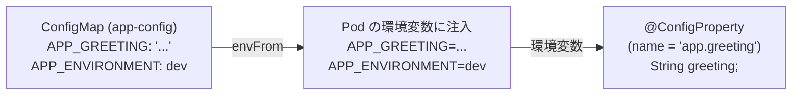

# 05. アプリ設定の注入 - ConfigMap と Secret

> 所要時間: 20分（座学 5分 + ハンズオン 15分）

## 座学: ConfigMap と Secret

### ConfigMap

- アプリケーションの**設定データ**を Key-Value 形式で管理
- 環境変数やファイルとして Pod に注入可能
- 平文で保存される → 機密情報には使わない

### Secret

- **機密データ**（パスワード、トークン等）を管理
- Base64 エンコードで保存（暗号化ではない。ETCD 暗号化で保護）
- ConfigMap と同様に環境変数やファイルとして注入可能

> **注意**: Base64 は**エンコード**であり**暗号化ではありません**。`base64 -d` で誰でもデコードできます。Secret が安全なのは、ETCD の暗号化と RBAC（アクセス制御）によるものです。マニフェストを Git に保存する際は、Secret の値を平文で含めないよう注意してください（本番では Sealed Secrets や External Secrets Operator の利用を推奨）。

### 注入方法の比較

| 方法 | 用途 | 例 |
|------|------|-----|
| `env` / `envFrom` | 環境変数として注入 | DB 接続 URL、アプリ設定 |
| `volumeMounts` | ファイルとしてマウント | 証明書、設定ファイル |

### ConfigMap / Secret 変更時の注意点

ConfigMap や Secret を更新しても、**既に稼働している Pod には自動反映されません**。反映には以下のいずれかが必要です。

- `oc rollout restart deployment/<name>` で Pod を再起動
- ボリュームマウント方式の場合は、数分後に自動反映される（環境変数方式では不可）

### 変数が注入される流れ

ConfigMap / Secret の値がアプリケーションに届くまでの流れを具体的に見てみましょう。



1. **ConfigMap** に設定値を Key-Value で定義
2. **Deployment** の `envFrom` で ConfigMap を指定 → Pod の**環境変数**として注入される
3. **application.properties** で `app.greeting=${APP_GREETING:デフォルト値}` のように環境変数を参照
4. **Java コード** の `@ConfigProperty(name = "app.greeting")` で値を取得

```java
@ConfigProperty(name = "app.greeting", defaultValue = "Hello from OpenShift!")
String greeting;
```

> `defaultValue` が指定されているため、ConfigMap が未設定でもアプリは起動できます。ローカル開発時にはデフォルト値が使われ、OpenShift 上では ConfigMap の値が優先されます。

### 本アプリでの使い分け

| リソース | 内容 | 注入先 |
|---------|------|--------|
| `app-config` | 挨拶メッセージ、環境名 | App Pod (環境変数) |
| `db-secret` | DB ユーザー名/パスワード/DB名 | App Pod + DB Pod (環境変数) |

## ハンズオン

### 1. ConfigMap の確認

```bash
cat base/app-configmap.yaml
```

現在の dev 環境での設定値:

```bash
cat overlays/dev/patch-config.yaml
```

### 2. ConfigMap の変更

挨拶メッセージを変更してみましょう。

```bash
# 現在の値を確認
curl -s https://${APP_URL}/hello | python3 -c "import sys,json; print(json.dumps(json.load(sys.stdin), indent=4, ensure_ascii=False))"
```

`overlays/dev/patch-config.yaml` の `APP_GREETING` の値を変更します。

変更前:
```yaml
  APP_GREETING: "Hello from Dev environment!"
```

変更後:
```yaml
  APP_GREETING: "こんにちは、OpenShift ワークショップへようこそ！"
```

以下の `sed` コマンドで置換できます:

```bash
sed -i 's/Hello from Dev environment!/こんにちは、OpenShift ワークショップへようこそ！/' overlays/dev/patch-config.yaml
```

置換結果を確認:

```bash
cat overlays/dev/patch-config.yaml
```

### 3. 変更を適用して再デプロイ

```bash
oc apply -k overlays/dev/
oc rollout restart deployment/app
oc rollout status deployment/app
```

### 4. 変更の確認

```bash
curl -s https://${APP_URL}/hello | python3 -c "import sys,json; print(json.dumps(json.load(sys.stdin), indent=4, ensure_ascii=False))"
```

期待される出力:
```json
{
    "message": "こんにちは、OpenShift ワークショップへようこそ！"
}
```

### 5. Secret の確認

```bash
cat base/db-secret.yaml
```

Secret は `stringData` で平文記述していますが、OpenShift に作成されると Base64 エンコードされます。

```bash
# 作成済み Secret の確認
oc get secret db-secret -o yaml
```

`data` フィールドの値が Base64 エンコードされていることを確認:

```bash
# Base64 デコード
oc get secret db-secret -o jsonpath='{.data.database-password}' | base64 -d
echo
```

### 6. アプリでの Secret 参照方法の確認

```bash
cat base/app-deployment.yaml
```

以下の箇所で Secret を参照しています:

```yaml
env:
  - name: DB_USERNAME
    valueFrom:
      secretKeyRef:
        name: db-secret
        key: database-user
  - name: DB_PASSWORD
    valueFrom:
      secretKeyRef:
        name: db-secret
        key: database-password
```

### 7. Pod に Secret の値が渡っていることを確認

実際に稼働している Pod の環境変数を確認して、Secret の値が正しく注入されているか検証します。

```bash
# App Pod の環境変数から DB 接続情報を確認
oc exec deployment/app -- env | grep DB_
```

期待される出力:
```
DB_USERNAME=workshop
DB_PASSWORD=workshop-pass
DB_URL=jdbc:postgresql://db:5432/workshop
```

DB Pod 側でも確認します:

```bash
oc exec deployment/db -- env | grep POSTGRESQL_
```

期待される出力:
```
POSTGRESQL_USER=workshop
POSTGRESQL_PASSWORD=workshop-pass
POSTGRESQL_DATABASE=workshop
```

App Pod と DB Pod の両方で、Secret から注入されたユーザー名・パスワードが一致していることがわかります。

### 8. DB Pod での Secret 参照確認

```bash
cat base/db-deployment.yaml
```

PostgreSQL コンテナでも同じ Secret を参照しています（`POSTGRESQL_USER`, `POSTGRESQL_PASSWORD`, `POSTGRESQL_DATABASE`）。

> **現場での話**: 手動運用で最も多い事故の一つが「dev の設定を prod に適用してしまう」です。例えば、dev 用の DB 接続先を prod にそのまま適用し、本番データが dev の DB を参照してしまうケースがあります。Kustomize overlays + ArgoCD で環境ごとの設定を Git 管理すれば、こうした**ヒューマンエラーを構造的に防止**できます。

---

**次のセクション**: [06. PV と PVC](06-pv-pvc.md)
