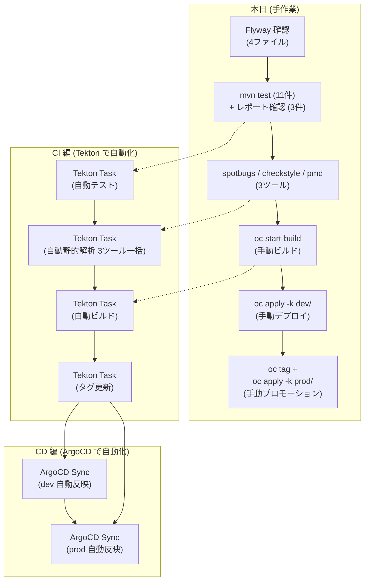
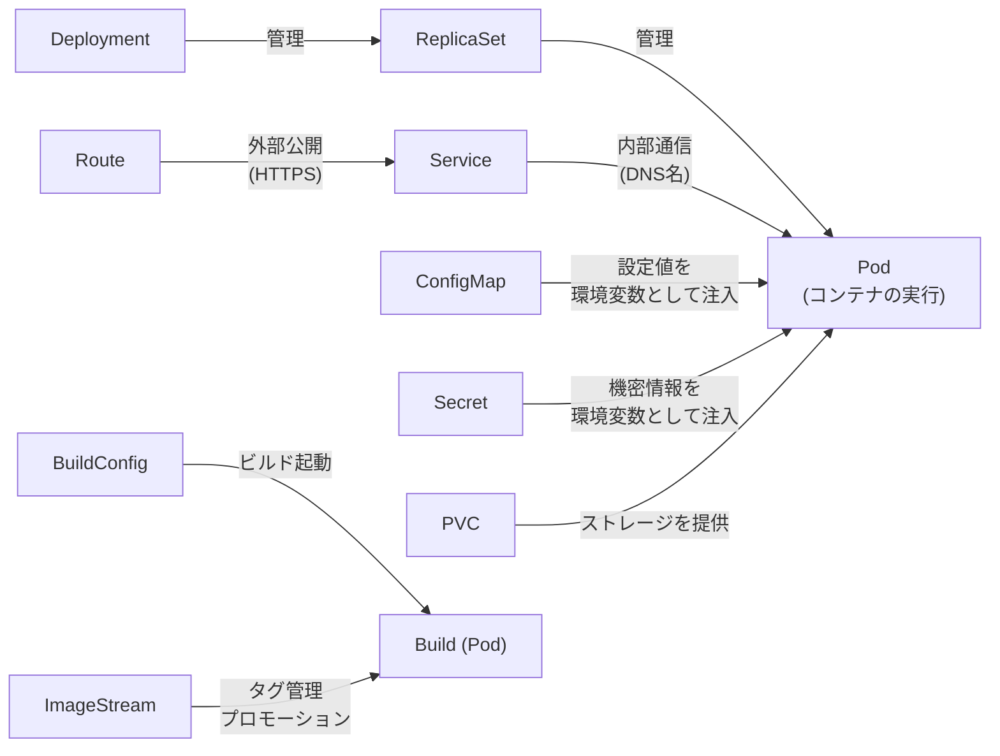

# 09. まとめ

> 所要時間: 7分（振り返り + QA）

## 本日のハンズオン振り返り

本日は、以下の作業を**すべて手作業で**実施しました。

| # | 作業 | 使用したコマンド・リソース |
|---|------|--------------------------|
| 01 | ソースコード確認 & Flyway 確認 (4ファイル) | `cat`, `ls` |
| 01 | テスト実行 (11件) & レポート確認 (3ファイル) | `mvn test` |
| 01 | 静的解析 (3ツール) | `mvn spotbugs:check` / `checkstyle:check` / `pmd:check` |
| 02 | イメージビルド | `oc new-build`, `oc start-build` |
| 03 | デプロイ | `oc apply -k overlays/dev/` |
| 04 | サービス公開 | Service + Route |
| 05 | 設定・機密情報の管理 | ConfigMap + Secret |
| 06 | データ永続化 | PVC |
| 07 | ログ確認 | `oc logs`, Console |
| 08 | プロモーション | `oc tag`, `oc apply -k overlays/prod/` |
| 10 | 補足: RBAC と ServiceAccount | `oc whoami`, `oc auth can-i` |

> **振り返り**: テストケースは 11 件、Flyway マイグレーションは 4 ファイル、静的解析 3 ツール分の結果確認も含めると、01 セクションだけで多くの手作業がありました。実際のプロジェクトではテストが数百件、マイグレーションが数十ファイルに膨れ上がるため、手動運用は現実的ではありません。

## CI/CD パイプラインとの対比

今回手作業で行った各ステップは、次回以降のワークショップで**自動化**されます。

> **重要**: 本ワークショップで使用したツール（SpotBugs, Checkstyle, PMD, Tekton, ArgoCD 等）はあくまで**一例**です。大切なのは個々のツールではなく、以下の**コンセプト**です。
>
> - **テストを CI パイプラインに組み込み**、コード push のたびに自動実行する
> - **静的解析を CI パイプラインに組み込み**、品質基準を満たさないコードのデプロイを防ぐ
> - **ビルド・デプロイを自動化**し、手作業によるミスを排除する
> - **環境ごとの設定を Git で管理**し、変更の追跡とロールバックを可能にする
>
> ツールは組織やプロジェクトの要件に合わせて選択してください（例: Jenkins / GitHub Actions / GitLab CI, SonarQube, Flux 等）。仕組みとして CI/CD パイプラインに品質ゲートを設けることが重要です。

### テスト & 静的解析 & ビルド → CI で自動化

| 本日の手作業 | コンセプト | CI での自動化例 (Tekton) |
|-------------|-----------|------------------------|
| Flyway マイグレーション (4ファイル) を手動確認 | DB スキーマ変更の自動検証 | Tekton Task が自動で検証・適用 |
| `mvn test` で 11 件のテストを手動実行 | テストの自動実行 | コード push 時に自動テスト実行 |
| テスト結果を 3 ファイル分目視確認 | テスト失敗時の自動フィードバック | テスト失敗時にパイプラインが自動停止 |
| 静的解析 3 ツールを手動実行・結果確認 | 品質ゲートの自動化 | 違反検出時にパイプラインが自動停止 |
| `oc start-build` で手動ビルド | ビルドの自動化 | テスト・解析通過後に自動ビルド |

### デプロイ & プロモーション → CD で自動化

| 本日の手作業 | コンセプト | CD での自動化例 (ArgoCD) |
|-------------|-----------|------------------------|
| `oc apply -k` で手動デプロイ | GitOps（Git を信頼できる唯一の情報源に） | Git リポジトリから自動 Sync |
| ConfigMap/Secret を手動編集・再適用 | 設定変更の Git 管理と自動反映 | Git push だけで差分検知・自動 Sync |
| `oc tag` + `oc apply -k` で手動プロモーション | 環境間プロモーションの自動化 | パイプライン完了後に自動でタグ更新・反映 |

### 全体の流れ



## 次回予告

- **第2回: CI 編 (Tekton)** -- テストとビルドを Tekton Pipeline で自動化
- **第3回: CD 編 (ArgoCD)** -- Git push をトリガーにデプロイを ArgoCD で自動化

## 本日使用した OpenShift リソースの全体像



## クリーンアップ

ワークショップで作成したリソースを削除する場合:

```bash
# 全環境 (dev + prod) を一括削除
oc delete all -l app=workshop-app
oc delete configmap,secret,pvc -l app=workshop-app
```

環境別に削除する場合:

```bash
# dev 環境のみ削除
oc delete all -l env=dev
oc delete configmap,secret,pvc -l env=dev

# prod 環境のみ削除
oc delete all -l env=prod
oc delete configmap,secret,pvc -l env=prod
```

> **注**: DevSpaces のプロジェクト (`<user>-devspaces`) 自体は削除しないでください。

## Q&A

質問がありましたらお気軽にどうぞ。
