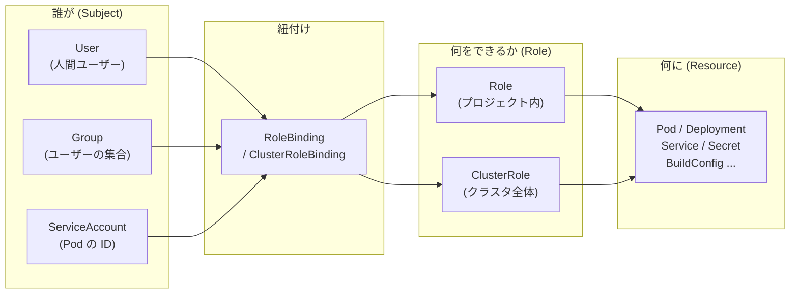
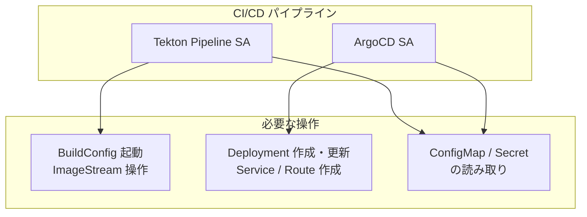

# 10. 補足: RBAC と ServiceAccount

> 所要時間: 15分（座学 5分 + ハンズオン 10分）

> **本章の位置付け**: この章は補足資料です。CI/CD（Tekton / ArgoCD）を導入する際に不可欠となる RBAC と ServiceAccount の基礎を、本ワークショップの環境を使って体験します。

## 座学: RBAC と ServiceAccount

### RBAC とは

RBAC（Role-Based Access Control）は、「**誰が**」「**何に**」「**何をできるか**」を制御する仕組みです。



| 概念 | スコープ | 説明 |
|------|---------|------|
| **Role** | プロジェクト内 | 特定プロジェクト内のリソースに対する権限を定義 |
| **ClusterRole** | クラスタ全体 | クラスタ全体のリソースに対する権限を定義 |
| **RoleBinding** | プロジェクト内 | Subject に Role（または ClusterRole）を紐付ける |
| **ClusterRoleBinding** | クラスタ全体 | Subject に ClusterRole を紐付ける（全プロジェクトに適用） |

### ServiceAccount とは

ServiceAccount（SA）は、**Pod が OpenShift API サーバーと通信する際の ID** です。人間が `oc login` で認証するように、Pod は SA の認証情報を使って API を呼び出します。

各プロジェクトには以下の SA が自動作成されます:

| ServiceAccount | 用途 |
|---------------|------|
| **default** | 特に SA を指定しない Pod が使用する。最小限の権限のみ |
| **builder** | `oc start-build` 等のビルド処理で使用。イメージの push 権限を持つ |
| **deployer** | Deployment のロールアウトで使用。Pod の作成・更新権限を持つ |

### CI/CD で RBAC が重要な理由

Tekton や ArgoCD は**人間の代わりに Pod がビルド・デプロイを実行**します。そのため、パイプラインの Pod が適切な権限を持つ SA で動作する必要があります。



> **最小権限の原則**: SA には必要最小限の権限のみを付与します。例えば、Tekton Pipeline の SA にクラスタ管理者権限を与えると、パイプラインの脆弱性がクラスタ全体のセキュリティリスクになります。

### Tekton Pipeline 用の RBAC 設定例

次回以降のワークショップで実際に使用する RBAC 設定のイメージです（本日は読み取りのみ）。

```yaml
# Pipeline 用の ServiceAccount
apiVersion: v1
kind: ServiceAccount
metadata:
  name: pipeline
---
# Pipeline SA に付与する Role
apiVersion: rbac.authorization.k8s.io/v1
kind: Role
metadata:
  name: pipeline-role
rules:
  - apiGroups: [""]
    resources: ["pods", "services", "configmaps", "secrets"]
    verbs: ["get", "list", "create", "update", "delete"]
  - apiGroups: ["apps"]
    resources: ["deployments"]
    verbs: ["get", "list", "create", "update", "patch"]
  - apiGroups: ["build.openshift.io"]
    resources: ["buildconfigs", "builds"]
    verbs: ["get", "list", "create", "update"]
  - apiGroups: ["image.openshift.io"]
    resources: ["imagestreams", "imagestreamtags"]
    verbs: ["get", "list", "create", "update"]
---
# SA と Role を紐付ける RoleBinding
apiVersion: rbac.authorization.k8s.io/v1
kind: RoleBinding
metadata:
  name: pipeline-rolebinding
subjects:
  - kind: ServiceAccount
    name: pipeline
roleRef:
  kind: Role
  name: pipeline-role
  apiGroup: rbac.authorization.k8s.io
```

ポイント:
- `rules` で操作対象のリソース (`resources`) と許可するアクション (`verbs`) を細かく制御
- `verbs` の例: `get`（取得）, `list`（一覧）, `create`（作成）, `update`（更新）, `delete`（削除）, `watch`（監視）
- 不要な権限は付与しない（例: Pipeline SA に `delete namespace` は不要）

## ハンズオン

> **注**: 以下のコマンドはすべて読み取り系の操作です。userXX の権限でも実行できます。

### 1. 自分のユーザー情報を確認

```bash
# 現在のユーザー名
oc whoami

# 現在のプロジェクト
oc project
```

### 2. 自分の権限を確認

`oc auth can-i` コマンドで、自分が特定の操作を実行できるかを確認できます。

```bash
# Deployment を作成できるか？
oc auth can-i create deployment

# Secret を閲覧できるか？
oc auth can-i get secret

# Namespace を削除できるか？
oc auth can-i delete namespace

# クラスタ全体の Node 一覧を取得できるか？
oc auth can-i list nodes
```

期待される出力:
```
yes    ← プロジェクト内の Deployment 作成は可能
yes    ← プロジェクト内の Secret 閲覧は可能
no     ← Namespace の削除は不可（クラスタ管理者のみ）
no     ← Node 一覧はクラスタスコープなので不可
```

> **ポイント**: 同じユーザーでも、プロジェクト内の操作とクラスタスコープの操作では権限が異なります。これが Role（プロジェクト内）と ClusterRole（クラスタ全体）の違いです。

### 3. 自分の全権限を一覧表示

```bash
oc auth can-i --list | head -30
```

出力の見方:

| 列 | 説明 |
|----|------|
| VERB | 許可されたアクション（get, list, create, update, delete 等） |
| RESOURCE | 操作対象のリソース |
| NON-RESOURCE URL | API エンドポイント（リソース以外） |

### 4. ServiceAccount の一覧を試みる（RBAC の体験）

プロジェクト内の ServiceAccount を一覧表示してみましょう。

```bash
oc get sa
```

期待される出力:
```
Error from server (Forbidden): serviceaccounts is forbidden: User "userXX" cannot list resource "serviceaccounts" in API group "" in the namespace "userXX-devspaces"
```

**エラーになりました。** これはまさに RBAC が機能している証拠です。`oc auth can-i` で事前確認してみましょう:

```bash
oc auth can-i list serviceaccounts
```

```
no
```

> **ポイント**: このように「操作が拒否された」こと自体が RBAC の学びです。自分の権限では ServiceAccount の一覧取得が許可されていません。クラスタ管理者が RoleBinding で `list serviceaccounts` の権限を付与すれば、このコマンドが使えるようになります。

### 5. 自分に許可されている操作と拒否される操作を比較

手順 4 で ServiceAccount の一覧は拒否されました。では、自分にはどのリソースの操作が許可されているのか、いくつか確認してみましょう。

```bash
# ビルド関連 — 許可されているはず
oc auth can-i create buildconfigs
oc auth can-i create builds

# イメージ関連 — 許可されているはず
oc auth can-i create imagestreams

# RBAC 関連 — 拒否されるはず
oc auth can-i create role
oc auth can-i create rolebinding
oc auth can-i list serviceaccounts
```

期待される出力:
```
yes    ← BuildConfig の作成は可能（ビルド操作に必要）
yes    ← Build の作成は可能
yes    ← ImageStream の作成は可能
no     ← Role の作成は不可（管理者のみ）
no     ← RoleBinding の作成は不可（管理者のみ）
no     ← ServiceAccount の一覧も不可
```

> **ポイント**: 皆さんのユーザーには、ワークショップで必要な操作（ビルド、イメージ管理）の権限は付与されていますが、RBAC リソース自体を操作する権限は付与されていません。これが**最小権限の原則**の実例です。CI/CD 環境でも同様に、Pipeline SA にはパイプラインの実行に必要な権限のみを付与します。

### 6. Pod が使用している ServiceAccount の確認

Pod の詳細情報から、どの SA で動作しているかを確認できます。

```bash
oc get pods -o custom-columns=NAME:.metadata.name,SA:.spec.serviceAccountName
```

期待される出力:
```
NAME                       SA
app-xxxxxxxxxx-xxxxx       default
db-xxxxxxxxxx-xxxxx        default
```

> **ポイント**: 現在のアプリ Pod は `default` SA で動作しています。Tekton Pipeline を導入すると、パイプラインの Pod は専用の `pipeline` SA で動作し、ビルドやデプロイに必要な権限のみを持ちます。

### 7. 自分の権限の全体像を把握する

`oc auth can-i --list` の出力をさらに確認し、自分に付与されている権限の全体像を把握します。

```bash
# ビルド・イメージ関連の権限を確認
oc auth can-i --list | grep -E "builds|imagestream|buildconfig"

# デプロイ関連の権限を確認
oc auth can-i --list | grep -E "deployments|pods|services|configmaps|secrets"
```

出力の見方:
- 表示されるリソースと Verb の組み合わせが、自分に許可されている操作
- 表示されないリソースは、操作権限がない

### 8. 権限がないとどうなるか

RBAC の重要性を実感するために、許可されていない操作を試してみましょう。

```bash
# RoleBinding の一覧（拒否される）
oc get rolebinding

# クラスタ全体の Namespace 一覧（拒否される）
oc get namespaces
```

いずれも `Forbidden` エラーになります。CI/CD パイプラインでも、SA の権限が不足していると同じエラーで処理が停止します。

---

## CI/CD との関係まとめ

| 本日の手作業 | 誰が実行した？ | CI/CD では？ |
|-------------|--------------|-------------|
| `oc start-build` | あなた（User） | Tekton Pipeline SA |
| `oc apply -k` | あなた（User） | ArgoCD SA |
| `oc tag` | あなた（User） | Tekton Pipeline SA |

本日はすべて**人間（User）が手動で**操作しました。CI/CD を導入すると、これらの操作は **ServiceAccount が自動で**実行します。そのため、適切な RBAC 設定が不可欠です。

> **現場での話**: 「Pipeline が動かない」というトラブルの多くは RBAC の設定不足が原因です。「SA に権限がない」「RoleBinding が正しいプロジェクトに作られていない」等のケースが頻発します。`oc auth can-i` で事前に権限を確認する習慣をつけると、トラブルシューティングが格段に速くなります。

---

**次のセクション**: [09. まとめ](09-summary.md)
